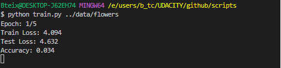
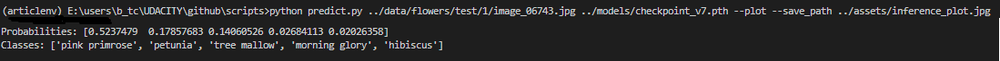

# Image Classifier Project Developed for the UDACITY - AI Programming with Python Bertelsmann Nanodegree.

## Summary

This project consisted of developing an image classifier using Deep Learning techniques with PyTorch. The project was divided into two stages. In the first one, a Jupyter notebook was developed implementing an image classifier with PyTorch, and in the second stage, the notebook was converted into a command-line application for others to use. I will detail each stage further.

## Results

- Image classification model with an accuracy of 85.4%.

- A Python script that allows the user to train an image classification model of flowers (the script can be used on any image data with labels) through the command line. In this script, the user can pass parameters to the model such as the number of training epochs and hidden units.

- A script that allows the use of the trained model to classify flower images through the command line.

## Process

### Part 1 - Developing the Notebook

1. Loading and Transforming the Data

    In this stage, methods were defined for data transformation and augmentation (adding rotated images) for the training data and transformation of validation and test data. The data was loaded using methods from torchvision and PyTorch.

2. Training the Model

    Here, the pretrained resnet50 model from the torchvision library was used, and a new classifier was defined for the specific task of classifying flower images. 
    The pretrained parameters were frozen, and only the new classifier was fine-tuned.The model was trained for 22 epochs with the following parameters:

    - Learning rate: 0.003.
    - 2 Hidden Layers.
    - Adam Optimzer.

3. Testing the Model on Unseen Data

    The model was tested on the test data, and the accuracy was 0.854.

4. Saving Checkpoint

    In this stage, the necessary parameters to reconstruct the trained model were saved:
        - epoch -> epoch at which the training was interrupted (in case it is necessary to train the model for more epochs).
        - optimizer -> Optimizer state (Adam). Necessary to resume model training.
        - hidden_layers -> Structure of the last layer defined in the training stage.
        - state_dict -> Model state, parameters 'learned' by the model during training (weights, biases, etc.).
        - class_to_idx -> Dictionary mapping indices and the name of the flower (taken from the training data).

5. Loading the Checkpoint and Reconstructing the Model

    With the saved model checkpoint, the model was reconstructed to classify on new images.

6. Making Predictions with the Model on an Image

    - A function was defined to load an image with PIL and perform transformations on the image to prepare it for input to the model.

    - Predict function to return the top k classes with the highest probabilities predicted by the model.

7. Checking Results

    As a way of checking the result, a plot was elaborated with the image and a bar chart with the top k classes with the highest probabilities.

    Check out the notebook [here](notebooks/Image%20Classifier%20Project2.ipynb).

### Part 2 - Developing Scripts

**1. Train**

    Script with the training part of the model similar to what was developed in the notebook. This script allows the user to train an image classifier through the command line. It is possible to define training parameters such as learning_rate, epochs, and hidden_layers. The user can also choose which pretrained architecture to use (alexnet, vgg11, or resnet50), whether to use GPU or CPU in training and testing, and resume training from a checkpoint.

**1.1. Usage Example**

**2. Predict**

Script to classify a flower image. This script allows the user to use the trained model to classify an image using the command line. For this, it is necessary to pass the image and model checkpoint paths. It is possible to pass the amount of classes with the highest probabilities defined by the model, the path to the file with the class names mapped by index (category_name), the path to save the plot generated by the script, and if GPU can be used.

**2.1 Usage Example**

You can check the scripts [here](scripts).

[Detailed explanation](scripts/README.en.md) on how to run the scripts.

## Conclusion

In this project, an image classifier with an accuracy of 85.4% was successfully developed. More than just a robust model, we developed an accessible and flexible solution, allowing any user to train their own classifier easily, all with just a simple command line.

## Next Steps

- Model deployment allowing users to get image classifications from their phone.
- Hyperparameter fine-tuning to increase model accuracy.
- More flexibility for the user to define the Last Layer (classifier).

## Tools

- Python, PyTorch, Torchvision, click, Jupyter Notebook.

## Skills Developed

- Training Neural Networks with PyTorch.
- Saving model checkpoints and returning training.
- Fine-tuning pretrained models.
- Creating Python scripts with optional command-line parameters using the click library.