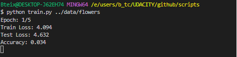
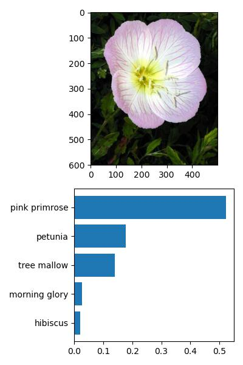

Projeto Desenvolvido para o Nanodegree da UDACITY - AI Programming with Python Bertelsmann.

# Classificador de Imagens

## Resumo

Esse projeto consistiu no desenvolvimento de um classificador de imagens com técnicas de Deep Learning utilizando o Pytorch. O projeto foi dividido em duas etapas. Na primeira, foi desenvolvido um jupyter notebook implementando um classificador de imagem com Pytorch, a segunda etapa consistiu em converter o notebook em uma aplicação em linha de comando para que outras pessoas pudessem usar. Irei detalhar cada etapa mais a frente.

## Resultados

- Modelo de classificação de imagens com acurácia de 85.4%.

- Um script em python que permite ao usuário treinar um modelo de classificação de imagens de flores (o script pode ser utilizado em qualquer dado de imagem com rótulos) através da linha de comando. Neste script o usuário pode passar paramêtros para o modelo como número de épocas de treinamento e hidden units.

- Um script que permite o uso do modelo treinado para classifcar imagem de flores através da linha de comando.

## Processo

### Parte 1 - Desenvolvendo o Notebook

1. Carregando e Transformando os Dados

    Nesta etapa foram definidos métodos para transformação e enriquecimento dos dados (adicionando as imagens rotacionadas) de treino e transformação dos dados de validação e teste.
    Os dados foram carregados utilizando métodos do torchvision e pytorch.

2. Treinamento o Modelo

    Aqui, foi utilizado o modelo pré-treinado resnet50 da biblioteca torchvision em que foi definido um novo classificador para a tarefa específica de classicar imagens de flores.
    Os parametros já treinados foram congelados e apenas o novo classificador foi tunado.

    O modelo foi treinado por 22 épocas com os seguintes parâmetros:

    - Learning rate: 0.003.
    - 2 Hidden Layers.
    - Adam Optimzer.

3. Teste do Modelo em dados não vistos

    O modelo foi testado nos dados de testes, e a acurácia foi de 0.854 

4. Salvando Checkpoint

    Nesta etapa, foram salvos os paramêtros necessários para reconstruir o modelo treinado:
        - epoch -> época em que o treinamento foi interrompido (caso seja necessário treinar o modelo por mais épocas).
        - optimizer -> Estado do optimizer (Adam). Necessário para retomarmos o treinamento do modelo.
        - hidden_layers -> Estrutura do último layer definido na etapa de treinamento. 
        - state_dict -> Estado do modelo, paramêtros 'aprendidos' pelo modelo durante o treinamento (pesos, viéses, etc).
        - class_to_idx -> Dicionário que mapeia indices e o nome da flor (retirado dos dados de treino).
        

5. Carregando o Chekpoint e Reconstruindo o modelo

    Com checkpoint salvo na útilma etapa, o modelo foi reconstuido para ser utilizado na classificação de novas imagens.

6. Previsões com o modelo em uma imagem

    - Foi definida  uma função para carregar uma imagem com PIL e realizar transformações na imagem deixando-a pronta para ser input do modelo.

    - Função predict para retornar as top k classes com maiores probabilidades previstas pelo modelo.

7. Checando resultados

    Como forma de checar o resultado, foi elaborado um plot com a imagem e um gráfico de barras com as top k classes com maiores probabilidades. 

Confira o notebook [aqui](notebooks/Image%20Classifier%20Project2.ipynb).

### Parte 2 - Desenvolvendo Scripts

**1. Train**

    Script com a parte de treinamento do modelo de forma semelhante ao que foi desenvolvido no notebook. Este script permite que o usuário treine um classificador de imagens através da linha de comando. É possível definir os paramêtros de treinamento como learning_rate, epochs, e hidden_layers. O usuário também pode escolher qual aquitetura pré-treinada usar (alexnet, vgg11 ou resnet50), além disso, é possível definir se irá utilizar GPU ou CPU no treinamento e teste, e retomar o treinamento a partir de um checkpoint.

**1.1. Exemplo de uso**

**2. Predict**

    Script para classificar a imagem de uma flor. Esse script permite que o usuário utilize o modelo treinado para classificar uma imagem utilizando a linha de comando. Para isso, é necessário passar o caminho da imagem e do checkpoint do modelo. É possível passar a quantidade de classes com as maiores probabilidades definidas pelo modelo, o caminho para o arquivo com os nomes das classes mapeados pelo índice (category_name), o caminho para salvar o plot gerado pelo script e se é possível utilizar GPU.

**2.1 Exemplo de uso**

Você pode conferir os scripts [aqui](scripts).

[Explicação detalhada](scripts/README.md) de como rodar os scripts.

## Conclusão

Neste projeto, foi desenvolvido com sucesso um classificador de imagens com uma acurácia de 85.4%. Mais do que apenas um modelo robusto, desenvolvemos uma solução acessível e flexível, permitindo que qualquer usuário treine seu próprio classificador com facilidade, tudo isso com apenas uma simples linha de comando.

## Próximos Passos 

- Deploy do modelo permitindo que os usuários obtenham a classificação de imagens do telefone.
- Fine-tuning dos hyperparamêtros para aumentar a acurácia do modelo.
- Mais flexibilidade para o usuário definir o Último Layer (classifier).

## Ferramentas
    Python, Pytorch, Torchvision, click, Jupyter Notebook.

## Habilidades desenvolvidas
- Treinar Neural Network com Pytorch.
- Salvar checkpoints de modelos e retornar treinamento. 
- Tunnar modelos pré-treinados.
- Criação de scripts em python com paramêtros opcionais na linha de comando com a biblioteca click.

