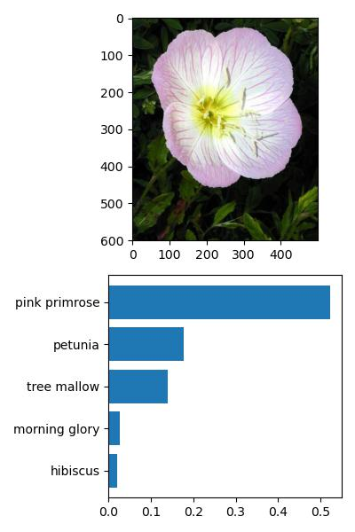

# How to Use the Scripts

In this document, we'll understand how to use the scripts and provide some recommendations.

* [1.0 Directory Structure](#10-directory-structure-of-the-data)
* [2.0 Training](#20-training)
* [3.0 Prediction](#30-prediction)

## 1.0 Directory Structure of the Data

For the scripts to work, it is essential that the data is in a correct structure.

We should have a folder with test, train, and valid subfolders. In each of these folders, we will have folders whose names are the indices corresponding to the species of the flowers stored in each folder.

    └── 📁data
        └── 📁flowers
            └── 📁test 
                └── 📁1 (index of the pink primrose species)
                    └── image_06743.jpg (image of a pink primrose)
                └── 📁10 (index of the globe thistle species)
                    └── image_07090.jpg (image of a globe thistle)
                ...
            └── 📁train
                └── 📁1
                    └── image_06743.jpg
                └── 📁10
                    └── image_07090.jpg
                ...
            └── 📁valid
                └── 📁1
                    └── image_06743.jpg
                └── 📁10
                    └── image_07090.jpg
                ...

## 2.0 Training

For the model training script, we have one mandatory parameter and 8 optional ones. Next, we'll discuss each of them.

- data_dir: This parameter is mandatory and refers to the path to the directory where the data is located. Ex: data/flowers. The script automatically completes the path to the test, train, and valid folders. Make sure the folder names are correct; otherwise, an error will occur.

- learning_rate: Optional parameter (default value 0.003). 

- save_dir: Optional parameter (default value 'checkpoint.pth'). Path to save the model checkpoint. When resume_training is activated, this path will be used to load the checkpoint to rebuild the already trained model.

- arch: Optional parameter (default value 'resnet'). With this parameter, you can choose between three pretrained architectures: 'resnet', 'vgg', and 'alexnet'.

- hidden_units: Optional parameter (default value 2048). Number of input features in the first layer of the classifier.

- epochs: Optional parameter (default value 5). Defines the number of training iterations.

- gpu (Flag): Optional parameter (default value False). This parameter, when True, allows the use of GPU to train the model, increasing processing speed. It is necessary that the GPU is available on your machine; otherwise, the CPU will be used.

- resume_training (Flag): Optional parameter (default value False). This parameter should be changed to True when the user wants to continue training some saved model.

- no_test (Flag): Optional parameter (default value False). Allows the user to disable the testing step on unseen test data in training.

Now let's see an example using all the parameters:

    python train.py ../data/flowers --learning_rate 0.001 --save_dir checkpoint_example.pth --arch vgg --hidden_units 25088 --epochs 20 --gpu --resume_training --no_test

Note that it is not necessary to pass the value for the gpu, resume_training, and no_test parameters. By passing them in the command, they automatically assume the opposite value of the default value because they were defined as flags. Additionally, it is not necessary to pass the name of the mandatory parameter, only its value.

The value of hidden_units varies according to the chosen architecture (arch). You can check the values for each structure with the help command:

    python train.py --help

## 3.0 Prediction

In the image classification script, we have two mandatory parameters and 5 optional ones. Next, we'll discuss each of them.

- image_path: Mandatory parameter. It is the path to the image file you want to classify with the model.

- checkpoint: Mandatory parameter. Path to the checkpoint file of the trained model that will be used to classify the image.

- top_k: Optional parameter (default value 5). Number of classes with the highest probabilities to be returned.

- category_name: Optional parameter (default value 'cat_to_name.json'). Path to the file that maps the indices corresponding to the species of flowers. This file is necessary to return the class names and not the indices.

- gpu (Flag): Optional parameter (default value False). This parameter, when True, allows the use of GPU to make predictions.

- save_path: Optional parameter (default value inference_example.jpg). Path to save the generated image when the plot parameter is activated.

- plot (Flag): Optional parameter (default value False). The user must pass this parameter if they want to plot the flower image and a bar chart with the top_k classes and corresponding probabilities.

Example:

    python predict.py ../data/test/1/image.jpg checkpoint_example.pth --top_k 10 --category_name ../assets/cat_to_name.json --gpu --plot --save_path classes_images.jpg

